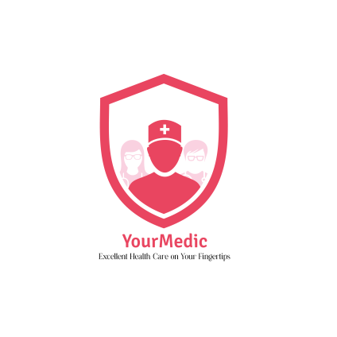
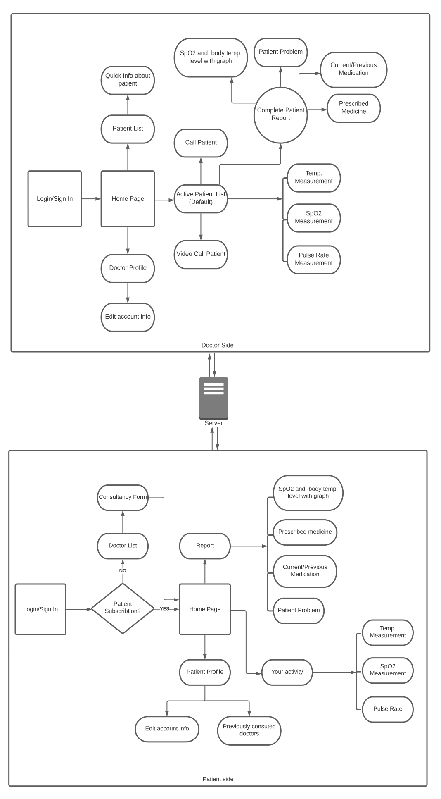

# Your Medic

---
## Table of Content

* [Description](#description)
* [Requirements](#requirements)
* [Technologies](#technologies)
* [Process Flow](#process-flow)

---

## Description
We have seen the medical infrastructure crumble in the past few months due to covid-19 and this being the reason, there has been the unavailability of medical facilities for many patients in urgent need of guidance of a doctor and a lack of technical supports for doctors to connect with their patients. Keeping this problem in mind, we came up with our App - "YourMedic" to provide a solution.

YourMedics is an App that works as a bridge between doctors and patients. This App will connect doctors with their patients and provide constant updates and daily reports of them. Considering the current scenario, if a patient is suffering from covid-19 and has consulted a doctor through our app, they can connect on a platform where the patient can keep updating their oxygen level, temperature etc. in the app. Later on, the doctors can follow up with them on daily basis and can generate daily reports.

In case if there is some abnormality in the oxygen levels or temperature of the patient, the app will alert the doctor about it and they can look over the patient's condition and prescribe the medication best suited for the condition. 

Along with these features, we have also added Prescribe medication feature for the doctors to prescribe the medicine to patients via the app and the patients will be notified of the same. The doctors can access all the medical history of a patient to provide the best possible treatment. Patients will also be reminded to take their medications in the timings mentioned by the doctor. 

We have also integrated this app with WhatsApp so that doctors and patients can connect over WhatsApp and have conversations when required. Also, in future updates of the App, we plan to add an inbuilt chat and video calling feature.

Through this App, we aim to provide technical support to the medical infrastructure & patients suffering in this pandemic and make medical facilities available for everyone on their fingertips.

---
## Requirements

* Andriod 6.0 or higher version
* Active Internet connection

---

## Technologies

* Language : Java, javascript
* Tools : NodeJS, Android
* Packages: Express, mongoose, jsonwebtooken, volley, firebase
* Database: MongoDB

---

## Process Flow

---

